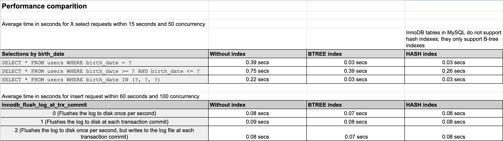

# MySQL with InnoDB operations performance testing

## Instructions
1. Run `docker-compose up` so the MySql container starts with a database with a table `users` for testing
2. Run the Java Sprig Boot Application that starts on port 8080
3. Populate the database with 40,000 records using the http://localhost:8080/populate endpoint
4. Run the `siege-script.sh` file uncommenting the test you want to perform
5. Run the `add-index.sql` script in order to add a b-tree index (or `add-index-hash.sql` to add a hash index, but under the hood it will also be a b-tree as InnoDB does not support hash indexes)
6. Observe siege results

## Conclusion
- SELECT operations run much faster when an index is applied.
- innodb_flush_log_at_trx_commit: despite the fact that `0` should be the faster and `1` the slowest, under scope of our testing the difference is small, taking into account the small dataset used